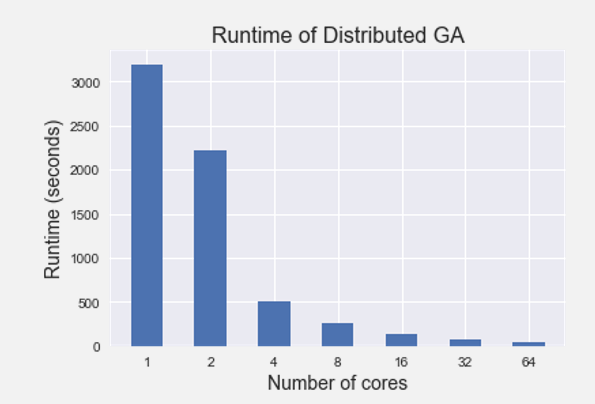
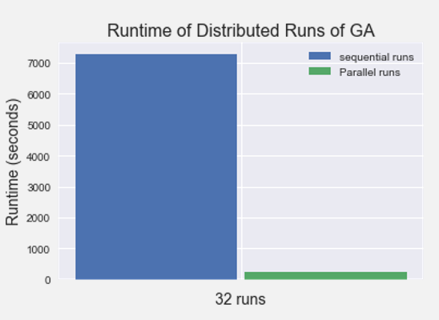

## Table of Content
1. [Overview](#overview)  
2. [Usage](#usage)  
3. [Results](#results)  
4. [Resources](#resources)  
5. [Report Issues](#report-issues)  

# Overview
This is a python repo for distributing evolutionary algorithms and distributing the runs of stochastic algorithms using Message Passing Interface (MPI).
I use MPI4PY to distribute computation across processes running on parallel. The code is tested in the 
<a href="https://wiki.chpc.ac.za/chpc:lengau" target="_blank">Lengau Cluster</a> of the Center of High-Performance
Computing (CHPC), South Africa. 

This repo aims at demonstrating how to perform two tasks that are most often encountered in academic research in 
physical sciences which are:
<ul>  
    <li>Distributing a computationally heavy algorithm.</li>
    <li>Distriubting the runs of a stochastic algorithm.</li>
</ul>

An example of the first case is when you have an evolutionary algorithm with heavy fitness evaluation. In this case, it makes
since to distribute fitness evaluation. An example of the second case is that you need to run a stochastic algorithm several time
where each run is seeded with a different seed for the random number generator to establish statistical significance of the results.

This repo shows you how to do these two tasks with Python and MPI. I assume you have a basic knowledge of MPI and PBS to run this code 
on a cluster (the ideal scenario). You can run it in your personal computer. However, in this case a better option would be using the 
standard python <a href="https://docs.python.org/3/library/multiprocessing.html">multiprocessing</a> library.

# Usage
Ideally, this code should be run in a cluster. In general it is a good practice to **test your MPI** code before running it. For this, 
you need an interactive MPI job in the cluster. The instructions of achieving this differs depending on the cluster your using. In the
Lengau cluster, you need to issue the following commands:
```console
qsub -I -P CSCI0806 -q test -l walltime=0:10:0 –l select=1:ncpus=4:mpiprocs=4:nodetype=haswell_reg.
module load chpc/python/3.7.0
```
This will schedule an interactive MPI job and load Python. Then to run your MPI script:
```console
mpirun -np 4 python script.py
```
where `script.py` is the main python program that starts the execution of your code.

After successfully testing your code in the interactive session, you need to submit to appropriate queue in the cluster. This is also differs
per cluster. Please check your cluster manual to see how to run MPI jobs. In the Lengau cluster, your script will look like:
```
#!/bin/bash
 #PBS -l select=2:ncpus=24:mpiprocs=24:nodetype=haswell_reg
 #PBS -P CSCI0806
 #PBS -l walltime=01:00:00
 #PBS -o /home/username/out_dir/resultfile.txt
 #PBS -e /home/username/err_dir/errorfile.err
 #PBS -N job_name
 #PBS -q normal
 module load chpc/python/3.7.0
 cd path_to_dir_containing_your_python_script
 nproc=`cat $PBS_NODEFILE | wc -l`
 echo nproc is $nproc
 cat $PBS_NODEFILE
 time mpirun -np $nproc python script.py > /home/dir/resultfile.txt

```

# Results
I tested the code in the Lengau cluster. The result of distributing the fitness evaluation of a genetic algorithm is shown in the figure below.
<p align="center">
  
</p>
From the figure, as the number of processes increases the computational time decreases. However, you need to be aware that it is not always the case
that adding more processes will map to **significantly** better performance. See this <a href="https://wiki.chpc.ac.za/scaling:start">demo</a>.

The following figure shows the result of distributing the runs. The longest column is when we executes the runs sequentially while the shorter column
is when we use MPI.
<p align="center">
  
</p>


# Resources
This code is part of a tutorial I presented for the MSc and PhD students at <a href="https://www.cs.up.ac.za/cs/nicog/">NICOG</a>. If you want a copy of the
powerpoint presentation please reach me at `ahmedhassan@aims.ac.za`.

# Report Issues
If you find any bug in the code or have any ideas for improving it, please reach me at `ahmedhassan@aims.ac.za`.